= Introduction and Setup

== Pre-requisites
For the ease of carrying out the workshop and considering the time at hand, we have already taken care of some of the steps that need to be considered before we can start with the actual Lab steps. The prerequisites that need to be in place are:

. Flow Management Data Hub Cluster should be created and running.
. Streams Messaging Data Hub Cluster should be created and running.
. Stream analytics Data Hub cluster should be created and running.
. Data provider should be configured in SQL Stream Builder.
. Have access to the file syslog-to-kafka.json.
. Environment should be enabled as part of the CDF Data Service.

== Setup & Configure Environment

=== 1. Configure permissions in Apache Ranger
==== 1.1 Kafka Permissions
===== Step 1 : In Ranger, select the Kafka repository that’s associated with the stream messaging datahub.

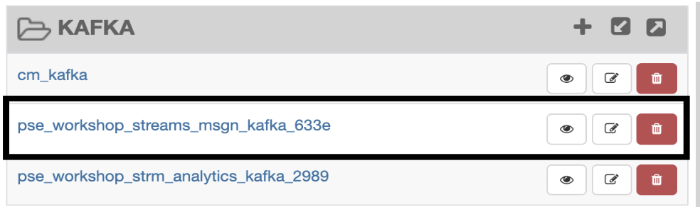

===== Step 2 : Add the user who will be performing the workshop to the existing permissions in both all-consumergroup and all-topic and click Save

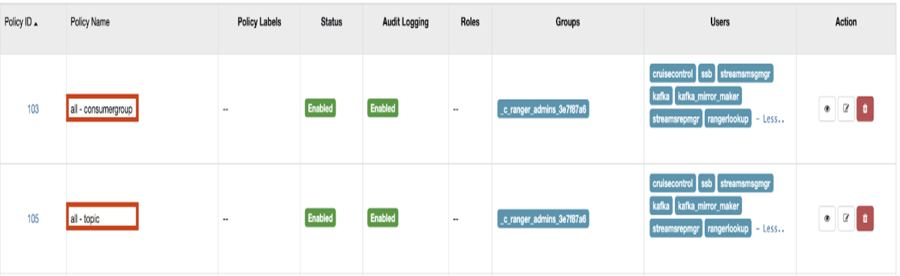

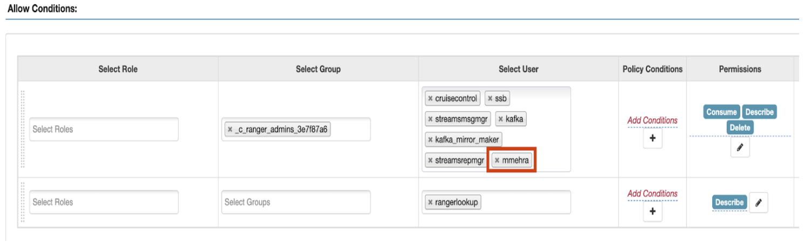

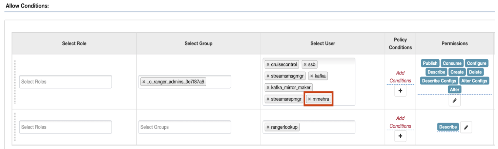

==== 1.2 Schema Registry Permissions
===== Step 1 : In Ranger, select the Schema Registry repository that’s associated with the stream messaging datahub.
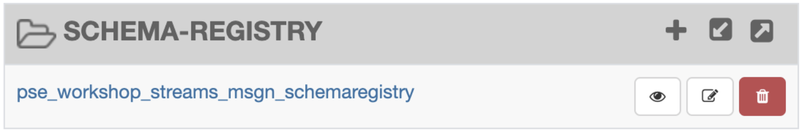

===== Step 2 : Add the user who will be performing the workshop to the existing permissions in the Policy for: **all - schema-group, schema-metadata, schema-branch, schema-version** and click Save.
image::./images/sect1/1-2step2-1.png[width=600]
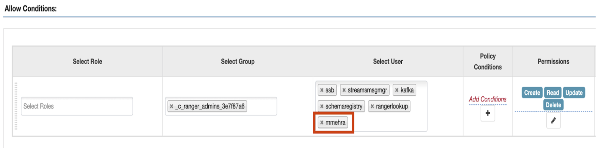

==== 1.3 SQL Stream Builder Permissions
===== Step 1 : Kafka - Streaming Analytics Datahub

====== 1. In Ranger, select the Kafka repository that’s associated with the streaming analytics datahub +
image::./images/sect1/1-3step1-1.png[width=600]

====== 2. Add the internal ssb user  to the existing permissions in both all-consumergroup and all-topic and click Save
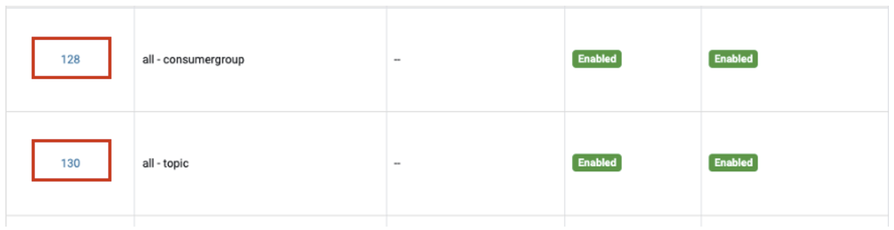
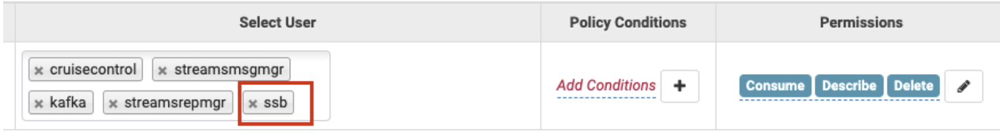
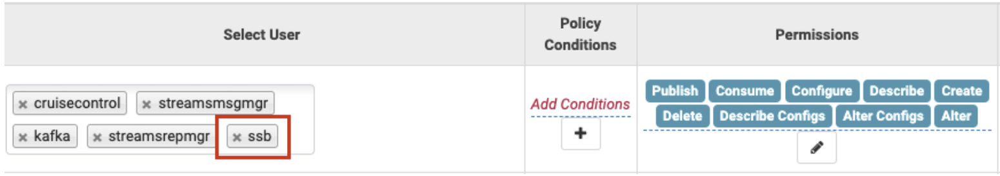

===== Step 2 : YARN - Streaming Analytics Datahub
====== 1. In Ranger, select the YARN repository that’s associated with the streaming analytics datahub.
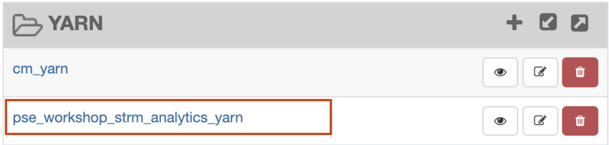

====== 2. Add the internal ssb user  to the existing permissions in both all-queue and click Save.
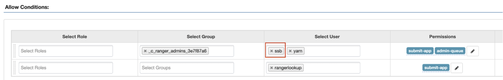

===== Step 3 : Kafka - Streams Messaging Datahub
====== 1. In Ranger, select the Kafka repository that’s associated with the stream messaging datahub.
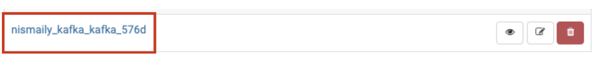

====== 2. Add the internal ssb user to the existing permissions in both all-consumergroup and all-topic and click Save
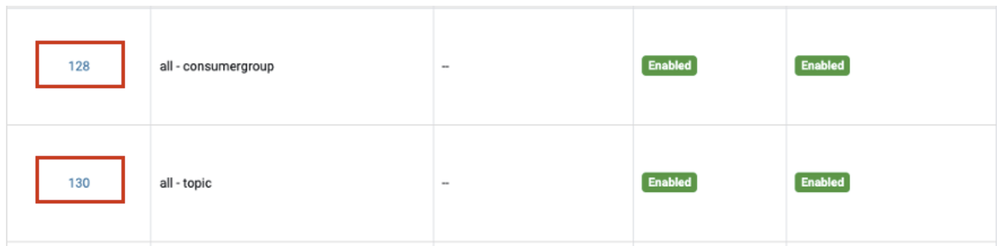
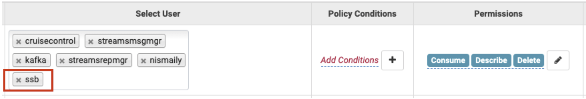
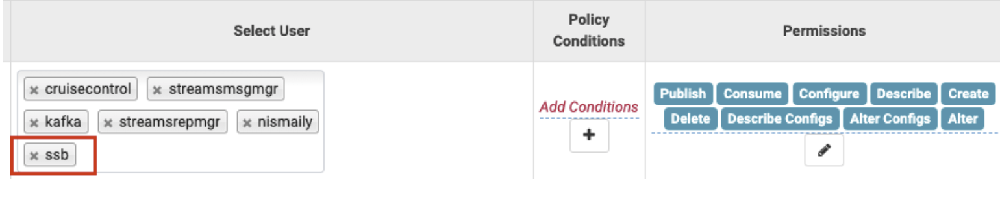

=== 2. Configure Data Providers in SQL Stream Builder
==== Step 1 : Open the Streaming SQL Console from the Streaming Analytics datahub

==== Step 2 : Click on Data Providers
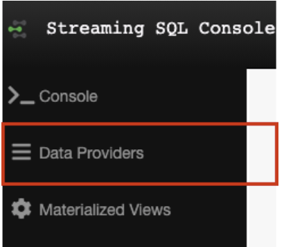

==== Step 3 : Edit the Brokers in the CDP Kafka Data Provider
The default brokers point to an internal Kafka cluster deployed as part of the streaming analytics datahub. Update the broker list to point to your brokers in the streams messaging datahub. This information can be obtained from the Brokers tab in Streams Messaging Manager. +

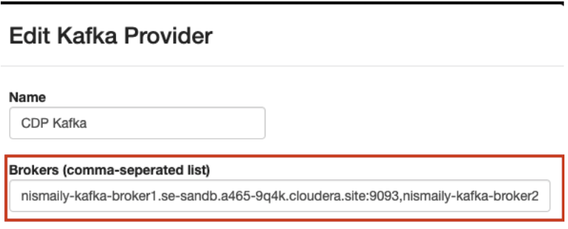
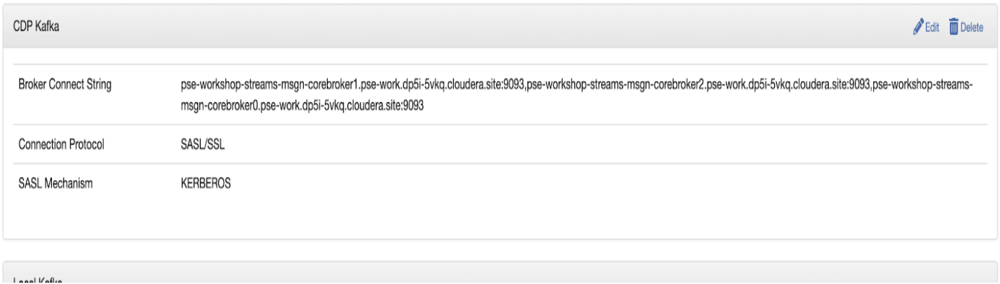

